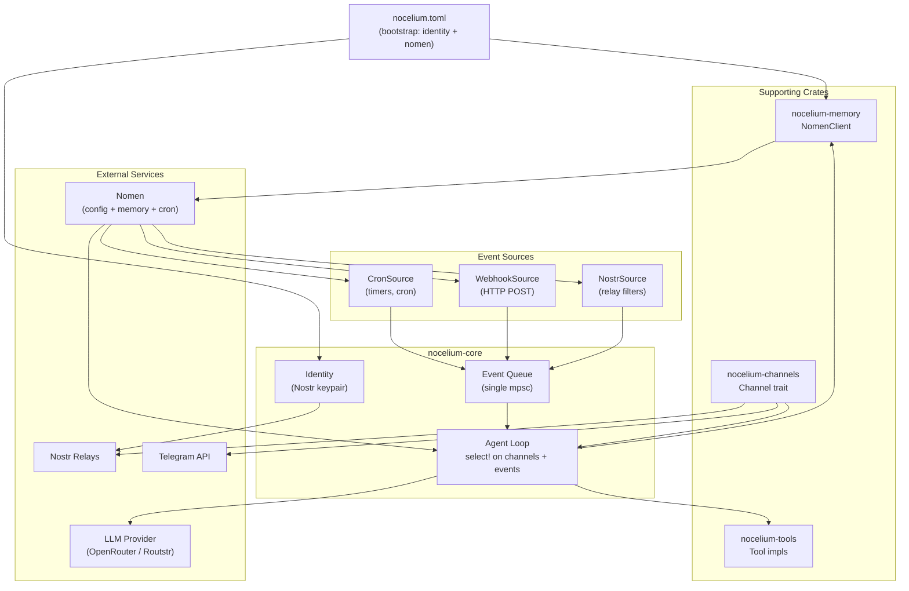
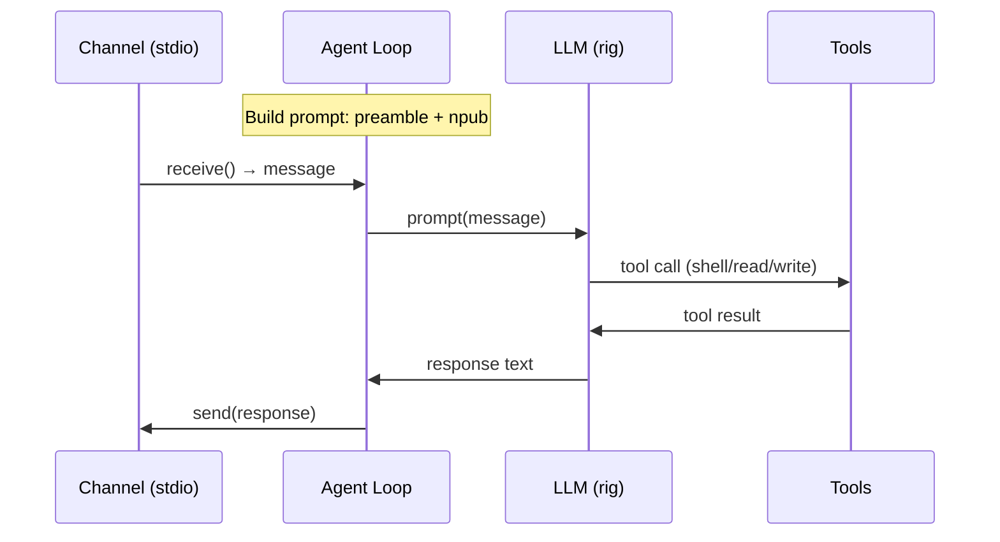
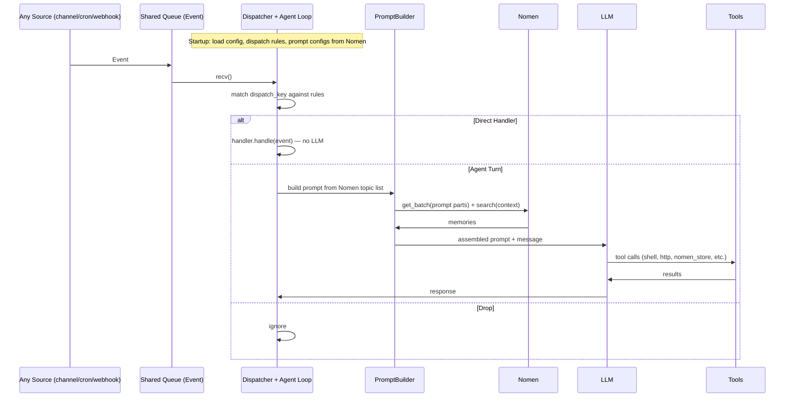
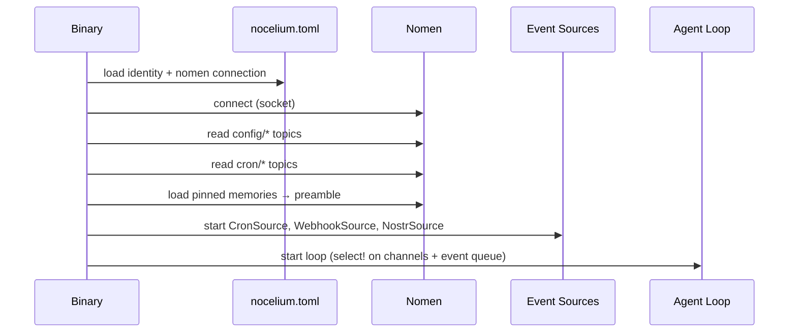

# Architecture

## Overview

Nocelium is a Nostr-native AI agent runtime. Single Rust binary, workspace of focused crates. Agents are Nostr identities with collective memory, autonomous scheduling, and Bitcoin payments.

## System Map



## Input / Output Model

```
Inbound (all produce Event):
  Channels (telegram, nostr, stdio) ─┐
  CronSource (timers, cron)          ├→ Shared mpsc → Dispatcher → Handler | AgentTurn | Drop
  WebhookSource (HTTP POST)          │
  NostrSource (relay subscriptions)  ┘

Dispatch:
  Event.dispatch_key matched against rules in Nomen (config/dispatch/rules)
  → Handler: direct code execution, no LLM
  → AgentTurn: build prompt from Nomen topics, call LLM
  → Drop: ignore

Outbound:
  Agent → Tools (shell, http, nostr_publish, nomen_store, etc.)
  No hardcoded routing — the LLM decides how to act.

Config + State:
  Bootstrap TOML → identity + Nomen connection only
  Everything else → Nomen (config/*, cron/*, prompt/*, memories)
```

## Interfaces

| Boundary | Trait / Type | Called by | Methods | Status |
|---|---|---|---|---|
| core → channels | `Channel` trait | agent loop | `listen(tx: Sender<Event>)`, `send()`, `edit()`, `delete()`, reactions, typing, pins, polls, location | ✅ impl: stdio |
| core → channels | `ChannelInfo` trait (optional) | agent loop | `list_chats()`, `list_topics()`, `get_chat()`, `get_member()` | 🔲 planned |
| core → dispatch | `Dispatcher` | agent loop | pattern-match dispatch_key → Handler / AgentTurn / Drop | 🔲 planned |
| core → dispatch | `PromptBuilder` | dispatcher | assemble prompt from Nomen topic lists | 🔲 planned |
| core → dispatch | `EventHandler` trait | dispatcher | `handle(event, ctx)` for non-LLM processing | 🔲 planned |
| core → tools | rig `Tool` trait | LLM via rig | `definition()`, `call()` | ✅ impl: shell, read, write |
| core → memory | `MemoryClient` (wraps `nomen-wire::ReconnectingClient`) | agent loop + tools + event sources | `search()`, `store()`, `get()`, `list()`, `delete()`, `subscribe()` | 🔲 stub |
| core → LLM | rig `Agent` | agent loop | `prompt()`, `stream_prompt()` | ✅ OpenRouter |
| core → events | `EventSource` trait | tokio::spawn | `start(tx: Sender<Event>)` | 🔲 planned |
| binary → core | `Identity`, `build_agent()` | main.rs | direct calls | ✅ |

## Data Flow (Current)



## Data Flow (Planned)



## Startup Sequence



## Prompt Assembly

Currently in `build_agent()`:
```
config.agent.preamble + "\n\nYour Nostr identity (npub): " + identity.npub()
```

Planned: preamble from `config/agent` in Nomen + pinned memories + npub. Per-message: message + `search()` results.

## Config Model

**Bootstrap (nocelium.toml):**

| Field | Purpose |
|---|---|
| `identity.key_path` | Nostr keypair file |
| `nomen.socket_path` | Unix socket to Nomen |

**Everything else in Nomen:**

| Topic | Contents | Status |
|---|---|---|
| `config/agent` | preamble, max_tokens, streaming | 🔲 |
| `config/provider` | model, base_url, api_key | 🔲 |
| `config/channels/*` | telegram, nostr settings | 🔲 |
| `config/tools` | tool toggles | 🔲 |
| `config/events/*` | webhook, nostr filter settings | 🔲 |
| `cron/*` | scheduled tasks | 🔲 |

## Directory Map

```
nocelium/
├── src/main.rs                     # binary entrypoint, CLI
├── config/nocelium.toml            # bootstrap config (identity + nomen only)
├── crates/
│   ├── nocelium-core/              # agent loop, identity, event sources
│   ├── nocelium-tools/             # tool implementations (one per file)
│   ├── nocelium-memory/            # Nomen client
│   └── nocelium-channels/          # I/O channels
├── docs/
│   ├── dispatch.md                  # event dispatch, handlers, prompt assembly
│   ├── event-sources.md            # event source implementations (cron, webhook, nostr)
│   ├── memory.md                   # Nomen integration spec
│   ├── nomen-contract.md           # Nomen API contract + version tracking
│   ├── channels.md                 # channel system spec
│   ├── tools.md                    # tool system spec
│   ├── payments.md                 # payment integration spec
│   └── config.md                   # configuration reference
├── scripts/check.sh
├── justfile
├── ARCHITECTURE.md                 # this file
├── AGENTS.md                       # agent conventions
└── CLAUDE.md                       # Claude Code instructions
```

## Build

```bash
just check    # cargo check
just test     # cargo nextest run
just lint     # cargo clippy
just ci       # all of the above
just run      # cargo run
```

---
*Agents: update this file when adding/removing crates, changing public traits, or altering data flow. Update relevant docs/ specs when changing subsystem behavior.*
