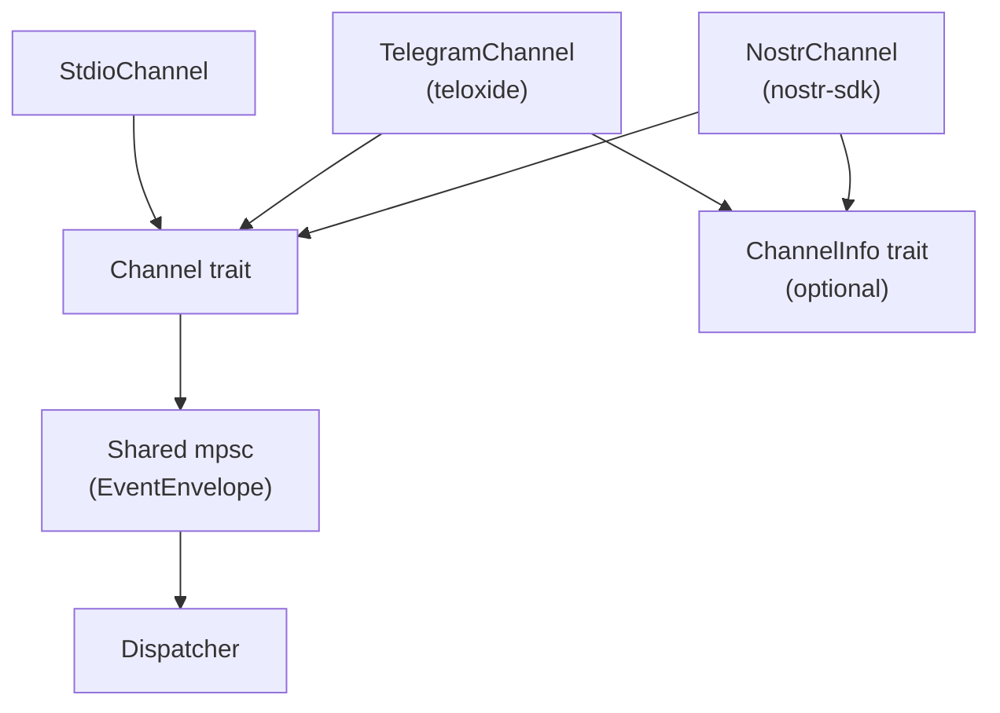

# Channels

## Overview

Channels are the bidirectional I/O layer between messaging platforms and the agent. Push-based: channels listen in background tasks and push `EventEnvelope` to a shared mpsc queue — the same queue used by all event sources. The dispatcher routes events based on dispatch keys.

## Components



Channels share the same `mpsc::Sender<Event>` as event sources. See [dispatch.md](dispatch.md) for the `Event` type and dispatch pipeline.

## Channel Trait

```rust
#[async_trait]
pub trait Channel: Send + Sync {
    fn name(&self) -> &str;
    fn capabilities(&self) -> ChannelCapabilities;

    // Inbound — pushes Event to shared queue
    async fn listen(&self, tx: mpsc::Sender<Event>) -> Result<()>;

    // Outbound
    async fn send(&self, message: &OutboundMessage) -> Result<SendResult>;
    async fn edit(&self, chat_id: &str, message_id: &str, text: &str) -> Result<()>;
    async fn delete(&self, chat_id: &str, message_id: &str) -> Result<()>;

    // Reactions
    async fn add_reaction(&self, chat_id: &str, message_id: &str, emoji: &str) -> Result<()>;
    async fn remove_reaction(&self, chat_id: &str, message_id: &str, emoji: &str) -> Result<()>;

    // Typing
    async fn start_typing(&self, chat_id: &str) -> Result<()>;
    async fn stop_typing(&self, chat_id: &str) -> Result<()>;

    // Pins
    async fn pin_message(&self, chat_id: &str, message_id: &str) -> Result<()>;
    async fn unpin_message(&self, chat_id: &str, message_id: &str) -> Result<()>;

    // Polls
    async fn send_poll(&self, chat_id: &str, poll: &Poll) -> Result<SendResult>;

    // Location
    async fn send_location(&self, chat_id: &str, lat: f64, lon: f64, live_period: Option<u32>, reply_to: Option<&str>) -> Result<SendResult>;
    async fn edit_location(&self, chat_id: &str, message_id: &str, lat: f64, lon: f64) -> Result<()>;
    async fn stop_location(&self, chat_id: &str, message_id: &str) -> Result<()>;

    // Health
    async fn health_check(&self) -> bool;
}
```

All optional methods have default no-op/error implementations.

## Event Production

Channels create `Event` with typed `Payload` for each platform update:

| Platform Event | Payload variant | Example dispatch_key |
|---|---|---|
| Text message | `Payload::Message` | `telegram:message:-1001234` |
| Text in topic | `Payload::Message` | `telegram:message:-1001234:42` |
| DM | `Payload::Message` | `telegram:message:direct:60996061` |
| Button press | `Payload::Callback` | `telegram:callback:approve_deploy` |
| Location update | `Payload::LocationUpdate` | `telegram:location:-1001234:60996061` |
| Photo/media only | `Payload::Media` | `telegram:media:-1001234` |

Voice/media with text are `Payload::Message` with attachments.

The channel's `listen()` is responsible for:
1. Receiving platform updates
2. Filtering by sender allowlist
3. Downloading media to local paths
4. Constructing `Event` with typed payload
5. Pushing to the shared queue

## Outbound Message

```rust
pub struct OutboundMessage {
    pub chat_id: String,
    pub text: String,                        // markdown
    pub reply_to_id: Option<String>,
    pub thread_id: Option<String>,
    pub attachments: Vec<OutboundAttachment>,
    pub buttons: Option<Vec<Vec<Button>>>,   // inline keyboard (rows)
    pub silent: bool,
}
```

## Capabilities

```rust
pub struct ChannelCapabilities {
    pub chat_types: Vec<ChatType>,
    pub media: bool,
    pub reactions: bool,
    pub reply: bool,
    pub edit: bool,          // also enables streaming via send() + edit()
    pub delete: bool,
    pub threads: bool,
    pub buttons: bool,
    pub polls: bool,
    pub typing: bool,
    pub pins: bool,
    pub voice: bool,
    pub location: bool,
    pub live_location: bool,
}
```

## Streaming via Edit

No dedicated streaming methods. If `capabilities.edit` is true, the agent loop streams by sending a placeholder then editing repeatedly. See [dispatch.md](dispatch.md) for how the agent loop handles this after dispatch.

## Channel Info (optional extension)

```rust
#[async_trait]
pub trait ChannelInfo: Channel {
    async fn list_chats(&self) -> Result<Vec<ChatInfo>>;
    async fn list_topics(&self, chat_id: &str) -> Result<Vec<TopicInfo>>;
    async fn get_chat(&self, chat_id: &str) -> Result<ChatInfo>;
    async fn get_member(&self, chat_id: &str, user_id: &str) -> Result<MemberInfo>;
}
```

## Implementations

### StdioChannel (implemented)
- `listen()`: read stdin lines → `Event { payload: Payload::Message(..), key: "stdio:message" }`
- `send()`: write to stdout
- Capabilities: `{ chat_types: [Direct] }` — everything else false

### TelegramChannel (planned)
- teloxide, long polling
- Full capabilities
- Produces different `kind` values per update type (message, callback, location_update, voice, media)
- Implements `ChannelInfo`
- Rate limiting internal

### NostrChannel (planned)
- nostr-sdk
- NIP-44 DMs, NIP-29 groups
- No edit/delete (immutable events)

## Rate Limiting

Internal per-channel. Transparent to caller. Queue + retry on 429.

## Config

From Nomen:
```
config/channels/telegram → { token, allowed_senders, ... }
config/channels/nostr → { relays, ... }
```

## Crate Placement

- `nocelium-channels/src/lib.rs` — `Channel` trait, `ChannelInfo` trait, `ChannelCapabilities`, `OutboundMessage`, `SendResult`
- `nocelium-channels/src/stdio.rs` — StdioChannel
- `nocelium-channels/src/telegram.rs` — TelegramChannel (planned)
- `nocelium-channels/src/nostr.rs` — NostrChannel (planned)

Note: `Event`, `Source`, `Payload` live in `nocelium-core/src/event.rs`. Channels depend on core for these types.
