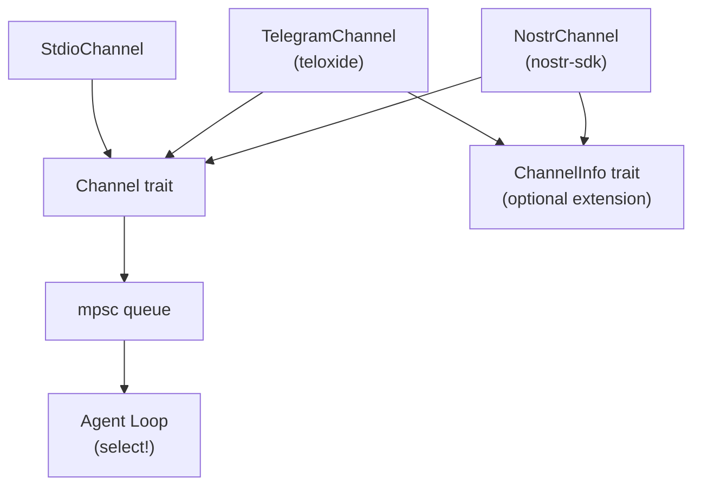

# Channels

## Overview

Channels are the bidirectional I/O layer between messaging platforms and the agent loop. Push-based: channels listen in background tasks and push to a shared mpsc queue. The agent loop `select!`s on channels and event sources.

## Components



## Channel Trait

```rust
#[async_trait]
pub trait Channel: Send + Sync {
    fn name(&self) -> &str;
    fn capabilities(&self) -> ChannelCapabilities;

    // Inbound
    async fn listen(&self, tx: mpsc::Sender<InboundMessage>) -> Result<()>;

    // Outbound
    async fn send(&self, message: &OutboundMessage) -> Result<SendResult>;
    async fn edit(&self, chat_id: &str, message_id: &str, text: &str) -> Result<()>;
    async fn delete(&self, chat_id: &str, message_id: &str) -> Result<()>;

    // Reactions
    async fn add_reaction(&self, chat_id: &str, message_id: &str, emoji: &str) -> Result<()>;
    async fn remove_reaction(&self, chat_id: &str, message_id: &str, emoji: &str) -> Result<()>;

    // Typing
    async fn start_typing(&self, chat_id: &str) -> Result<()>;
    async fn stop_typing(&self, chat_id: &str) -> Result<()>;

    // Pins
    async fn pin_message(&self, chat_id: &str, message_id: &str) -> Result<()>;
    async fn unpin_message(&self, chat_id: &str, message_id: &str) -> Result<()>;

    // Polls
    async fn send_poll(&self, chat_id: &str, poll: &Poll) -> Result<SendResult>;

    // Location
    async fn send_location(&self, chat_id: &str, lat: f64, lon: f64, live_period: Option<u32>, reply_to: Option<&str>) -> Result<SendResult>;
    async fn edit_location(&self, chat_id: &str, message_id: &str, lat: f64, lon: f64) -> Result<()>;
    async fn stop_location(&self, chat_id: &str, message_id: &str) -> Result<()>;

    // Health
    async fn health_check(&self) -> bool;
}
```

All methods except `name()`, `capabilities()`, `listen()`, `send()`, and `health_check()` have default no-op/error implementations. Channels implement only what they support.

## Inbound Message

```rust
pub struct InboundMessage {
    // Identity
    pub id: String,
    pub channel: String,
    pub chat_id: String,
    pub sender_id: String,
    pub sender_name: Option<String>,
    pub sender_handle: Option<String>,

    // Content
    pub text: String,                        // stripped of mentions
    pub raw_text: Option<String>,            // original with mentions

    // Context
    pub chat_type: ChatType,                 // Direct, Group, Thread
    pub group_subject: Option<String>,
    pub thread_id: Option<String>,
    pub timestamp: u64,

    // Reply context
    pub reply_to_id: Option<String>,
    pub reply_to_text: Option<String>,
    pub reply_to_sender: Option<String>,

    // Mentions
    pub mentions: Vec<String>,
    pub was_mentioned: bool,

    // Media
    pub attachments: Vec<Attachment>,

    // Location
    pub location: Option<Location>,

    // Callback (button press)
    pub callback_data: Option<String>,
    pub callback_query_id: Option<String>,
}
```

## Outbound Message

```rust
pub struct OutboundMessage {
    pub chat_id: String,
    pub text: String,                        // markdown
    pub reply_to_id: Option<String>,
    pub thread_id: Option<String>,
    pub attachments: Vec<OutboundAttachment>,
    pub buttons: Option<Vec<Vec<Button>>>,   // inline keyboard (rows)
    pub silent: bool,
}
```

## Capabilities

```rust
pub struct ChannelCapabilities {
    pub chat_types: Vec<ChatType>,
    pub media: bool,
    pub reactions: bool,
    pub reply: bool,
    pub edit: bool,          // also enables streaming via send() + edit()
    pub delete: bool,
    pub threads: bool,
    pub buttons: bool,
    pub polls: bool,
    pub typing: bool,
    pub pins: bool,
    pub voice: bool,
    pub location: bool,
    pub live_location: bool,
}
```

No `streaming` capability — streaming is done via `send()` + `edit()`. If `edit` is true, the agent loop can stream by sending a placeholder then editing repeatedly.

## Streaming via Edit

```rust
if channel.capabilities().edit {
    let result = channel.send(placeholder).await?;
    // Throttle: edit every 500ms or 50 chars
    for tokens in stream {
        buffer.push_str(&token);
        channel.edit(chat_id, &result.message_id, &buffer).await.ok();
    }
    channel.edit(chat_id, &result.message_id, &final_text).await?;
} else {
    // Buffer all, send once
    channel.send(full_message).await?;
}
```

Streaming logic lives in the agent loop, not the channel.

## Channel Info (optional extension)

```rust
#[async_trait]
pub trait ChannelInfo: Channel {
    async fn list_chats(&self) -> Result<Vec<ChatInfo>>;
    async fn list_topics(&self, chat_id: &str) -> Result<Vec<TopicInfo>>;
    async fn get_chat(&self, chat_id: &str) -> Result<ChatInfo>;
    async fn get_member(&self, chat_id: &str, user_id: &str) -> Result<MemberInfo>;
}
```

For channels that support metadata queries (Telegram, Nostr). Not required — stdio doesn't implement it.

## Implementations

### StdioChannel (implemented)
- `listen()`: read lines from stdin → InboundMessage with minimal fields
- `send()`: write to stdout
- Capabilities: `{ chat_types: [Direct] }` — everything else false

### TelegramChannel (planned)
- teloxide bot framework, long polling
- Full capabilities: media, reactions, reply, edit, delete, threads, buttons, polls, typing, pins, location, live location
- Implements `ChannelInfo` for chat/topic queries
- Sender allowlisting in `listen()` from Nomen config
- Rate limiting internal: queue + retry on 429
- Callback queries: auto-answer in listen(), deliver as InboundMessage with callback_data

### NostrChannel (planned)
- nostr-sdk client
- NIP-44 encrypted DMs, NIP-29 group chat
- Capabilities: reply, threads (NIP-29 groups)
- No edit/delete (Nostr events are immutable)

## Rate Limiting

Handled inside each channel implementation, transparent to the agent loop:
- Telegram: 30 msg/sec across chats, ~1 msg/sec same chat
- Implementation queues and retries on 429
- Streaming edit throttle (500ms) in agent loop already respects limits

## Multi-Channel

All channels push to the same `mpsc::Sender<InboundMessage>`. The agent loop holds `Arc<dyn Channel>` refs and routes responses by `InboundMessage.channel` name.

## Config

From Nomen:
```
config/channels/telegram → { token, allowed_senders, ... }
config/channels/nostr → { relays, ... }
```

## Crate Placement

- `nocelium-channels/src/lib.rs` — traits, types (`Channel`, `ChannelInfo`, `InboundMessage`, `OutboundMessage`, `ChannelCapabilities`)
- `nocelium-channels/src/stdio.rs` — StdioChannel
- `nocelium-channels/src/telegram.rs` — TelegramChannel (planned)
- `nocelium-channels/src/nostr.rs` — NostrChannel (planned)
