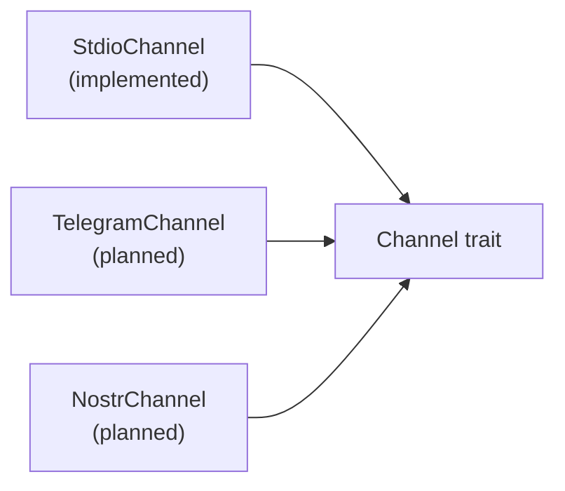
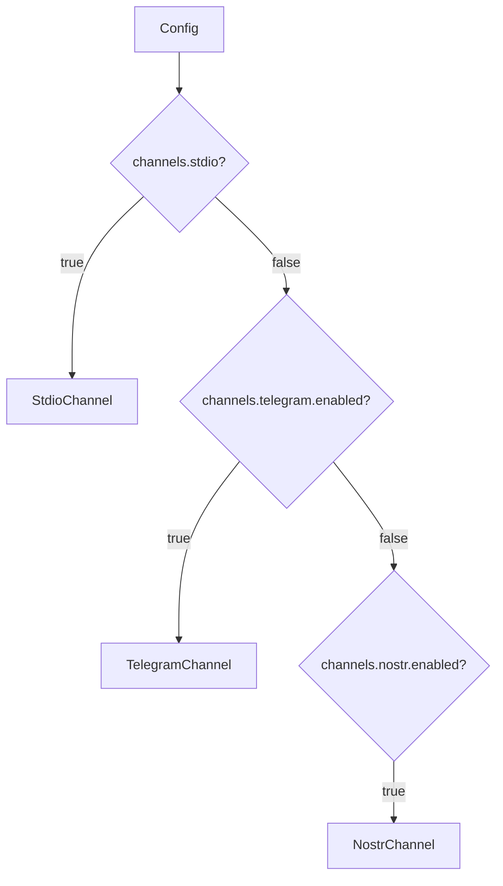

# Channels

## Overview

Channels are the bidirectional I/O layer between external messaging systems and the agent loop. Each channel implements the `Channel` trait.

## Channel Trait

```rust
#[async_trait]
pub trait Channel: Send {
    async fn receive(&mut self) -> Result<Option<String>>;
    async fn send(&mut self, message: &str) -> Result<()>;
    async fn send_chunk(&mut self, chunk: &str) -> Result<()>;
    async fn flush(&mut self) -> Result<()>;
}
```

**Contract:**
- `receive()` blocks until a message arrives. Returns `None` when the channel closes.
- `send()` delivers a complete message.
- `send_chunk()` + `flush()` support streaming (token-by-token output).

## Implementations



### StdioChannel (implemented)
- Interactive terminal I/O
- Uses `tokio::io::Stdin` / `Stdout` with `BufReader`
- Prompt: `> ` on each receive
- For local development and testing

### TelegramChannel (planned)
- `teloxide` bot framework
- Long polling or webhook mode
- Support: DMs, group chats, inline keyboards, reactions, media
- Sender allowlisting from config
- Streaming: buffer chunks, send as message edits or single message on flush

### NostrChannel (planned)
- `nostr-sdk` client
- NIP-44 encrypted DMs for private conversations
- NIP-29 group chat for team/public interactions
- Agent receives events matching its npub
- Agent responds by publishing signed events

## Channel Selection

The binary (`main.rs`) selects the channel based on config:



Currently only stdio is implemented. Future: multi-channel support (agent listens on multiple channels concurrently via `tokio::select!`).

## Config

```toml
[channels]
stdio = true

[channels.telegram]
enabled = false
token = ""
allowed_senders = []

[channels.nostr]
enabled = false
relays = ["wss://relay.damus.io"]
```

## Crate Placement

All implementations live in `nocelium-channels/src/`:
- `lib.rs` — `Channel` trait definition
- `stdio.rs` — StdioChannel
- `telegram.rs` — TelegramChannel (planned)
- `nostr.rs` — NostrChannel (planned)
