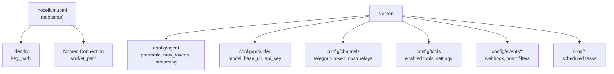
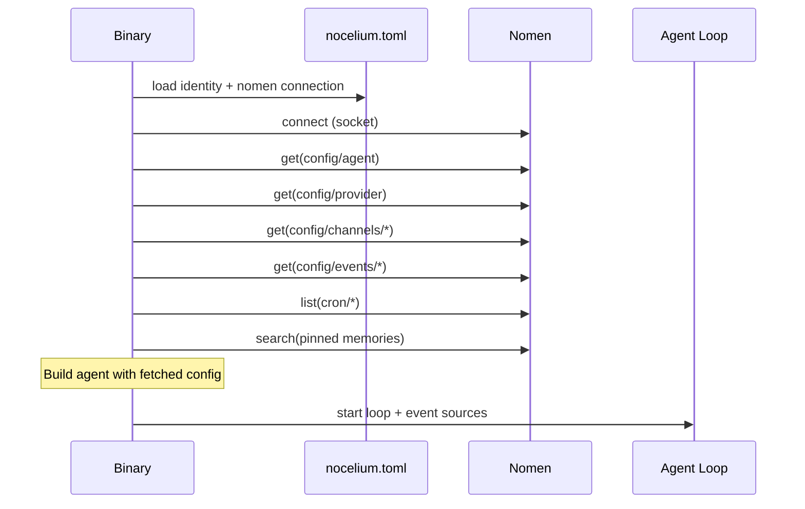

# Configuration

## Overview

Nocelium uses a minimal bootstrap TOML file for identity and Nomen connection. All other configuration lives in Nomen as memories with well-known topics.

## Bootstrap Config (nocelium.toml)

The only local file. Just enough to establish identity and connect to Nomen:

```toml
[identity]
key_path = "~/.nocelium/identity.json"    # Nostr keypair location

[nomen]
socket_path = "/run/nomen.sock"           # Unix socket (primary)
# http_url = "http://127.0.0.1:3849/memory/api"  # HTTP fallback
```

**Loading order:**
1. CLI `--config <path>` if provided
2. `./nocelium.toml` (working directory)
3. `~/.config/nocelium/config.toml` (user config)
4. Error if none found

## Nomen-Stored Configuration

Everything else is stored as Nomen memories under `config/*` topics. The agent reads these at startup and can modify them at runtime via tools.



## Nomen Config Topics

| Topic | Contents | Example |
|---|---|---|
| `config/agent` | Agent behavior | `{ preamble: "...", max_tokens: 4096, streaming: true }` |
| `config/provider` | LLM provider | `{ model: "anthropic/claude-sonnet-4-20250514", base_url: "...", api_key: "..." }` |
| `config/channels/telegram` | Telegram settings | `{ token: "...", allowed_senders: [...] }` |
| `config/channels/nostr` | Nostr channel | `{ relays: ["wss://..."] }` |
| `config/tools` | Tool toggles | `{ shell: true, filesystem: true, web_search: false }` |
| `config/events/webhook` | Webhook listener | `{ bind: "127.0.0.1:8090", sources: { github: { secret: "..." } } }` |
| `config/events/nostr` | Nostr event filters | `{ filters: [...] }` |
| `cron/heartbeat` | Cron task | `{ schedule: "0 */6 * * *", payload: "Run heartbeat" }` |
| `cron/*` | Other cron tasks | Agent-managed via nomen_store/nomen_delete |

## Startup Sequence



## Self-Configuration

The agent can modify its own config at runtime:
- `nomen_store("config/provider", ...)` — change model
- `nomen_store("cron/new-task", ...)` — add a cron job
- `nomen_delete("cron/old-task")` — remove a cron job

No restart needed for cron changes — CronSource watches Nomen for updates.

## Nomen Unavailable

If Nomen is unreachable at startup, the agent has only its identity. Options:
- Retry connection with backoff
- Start in degraded mode (identity only, no tools/channels/config)
- The bootstrap TOML can optionally include a minimal `fallback_preamble` for degraded operation

## Environment Variables

| Variable | Overrides | Purpose |
|---|---|---|
| `OPENROUTER_API_KEY` | `config/provider` api_key | API key fallback |
| `NOMEN_SOCKET` | `nomen.socket_path` | Socket path override |
