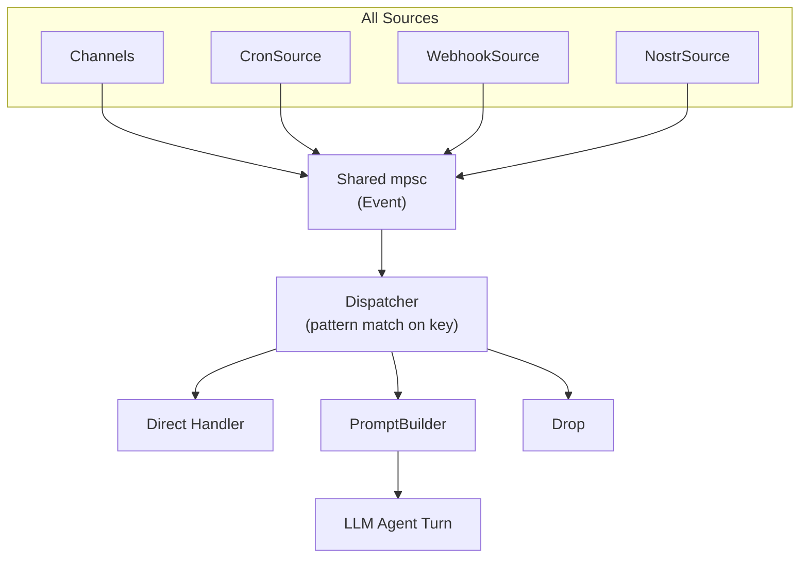

# Event Dispatch

## Overview

All inbound events — messages, cron ticks, webhooks, location updates, button presses — flow through a single dispatch pipeline. Each event has a dispatch key that maps to rules defining how it's processed.

## Components



## Event

Small envelope with typed payload.

```rust
pub struct Event {
    pub key: String,              // dispatch key (computed at creation)
    pub source: Source,
    pub timestamp: u64,
    pub payload: Payload,
}

pub enum Source {
    Channel {
        name: String,             // "telegram", "nostr", "stdio"
        chat_id: String,
        sender_id: String,
    },
    Cron(String),                 // task id
    Webhook(String),              // source name
    Nostr(String),                // filter id
}

pub enum Payload {
    Message(Message),
    Callback(Callback),
    LocationUpdate(Location),
    Media(Vec<Attachment>),
    Raw(Value),                   // webhooks, generic events
}
```

## Message Types

```rust
pub struct Message {
    pub id: String,
    pub text: String,
    pub sender_name: Option<String>,
    pub sender_handle: Option<String>,
    pub chat_type: ChatType,
    pub group_subject: Option<String>,
    pub thread_id: Option<String>,
    pub reply_to: Option<ReplyContext>,
    pub mentions: Vec<String>,
    pub was_mentioned: bool,
    pub attachments: Vec<Attachment>,
    pub location: Option<Location>,
}

pub struct ReplyContext {
    pub message_id: String,
    pub text: Option<String>,
    pub sender: Option<String>,
}

pub struct Callback {
    pub data: String,
    pub query_id: String,
    pub message_id: Option<String>,
}

pub enum ChatType { Direct, Group, Thread }
```

## Dispatch Key

Hierarchical, glob-matchable: `{source}:{kind}:{context...}`

| Event | dispatch_key |
|---|---|
| Text in group | `telegram:message:-1001234` |
| Text in topic | `telegram:message:-1001234:42` |
| DM | `telegram:message:direct:60996061` |
| Button press | `telegram:callback:approve_deploy` |
| Live location | `telegram:location:-1001234:60996061` |
| Voice in group | `telegram:message:-1001234` (with voice attachment) |
| Heartbeat | `cron:heartbeat` |
| GitHub webhook | `webhook:github/push` |
| Nostr DM | `nostr:dm` |
| Stdio input | `stdio:message` |

Key is computed from `Source` + `Payload` variant:

```rust
impl Event {
    fn compute_key(source: &Source, payload: &Payload) -> String {
        let kind = match payload {
            Payload::Message(_) => "message",
            Payload::Callback(cb) => return format!("{}:callback:{}", source_prefix(source), cb.data),
            Payload::LocationUpdate(_) => "location",
            Payload::Media(_) => "media",
            Payload::Raw(_) => "raw",
        };
        match source {
            Source::Channel { name, chat_id, sender_id } => {
                // check chat_type from Message payload for direct detection
                format!("{name}:{kind}:{chat_id}")
            }
            Source::Cron(id) => format!("cron:{id}"),
            Source::Webhook(name) => format!("webhook:{name}"),
            Source::Nostr(filter) => format!("nostr:{filter}"),
        }
    }
}
```

## Dispatch Rules

Stored in Nomen (`config/dispatch/rules`). First match wins.

```rust
pub struct DispatchRule {
    pub pattern: String,              // glob pattern
    pub action: DispatchAction,
    pub prompt_config: Option<String>, // Nomen topic for prompt assembly
}

pub enum DispatchAction {
    AgentTurn,                        // build prompt, call LLM
    Handler(String),                  // direct handler, no LLM
    Drop,                             // ignore
}
```

### Example Rules

```json
[
    { "pattern": "telegram:location:*",     "action": "handler:live_location" },
    { "pattern": "telegram:callback:ack_*", "action": "handler:auto_ack" },
    { "pattern": "cron:consolidate",        "action": "handler:memory_consolidate" },
    { "pattern": "cron:heartbeat",          "action": "agent_turn", "prompt_config": "config/prompts/heartbeat" },
    { "pattern": "webhook:github/*",        "action": "agent_turn", "prompt_config": "config/prompts/webhook" },
    { "pattern": "telegram:message:*",      "action": "agent_turn", "prompt_config": "config/prompts/telegram" },
    { "pattern": "nostr:*",                 "action": "agent_turn", "prompt_config": "config/prompts/nostr" },
    { "pattern": "*",                       "action": "agent_turn" }
]
```

## Handlers

```rust
#[async_trait]
pub trait EventHandler: Send + Sync {
    fn name(&self) -> &str;
    async fn handle(&self, event: &Event, ctx: &HandlerContext) -> Result<()>;
}

pub struct HandlerContext {
    pub channels: HashMap<String, Arc<dyn Channel>>,
    pub nomen: MemoryClient,
}
```

Built-in handlers:

| Handler | Trigger | Action |
|---|---|---|
| `live_location` | `*:location:*` | `edit_location()`, store in Nomen |
| `auto_ack` | `*:callback:ack_*` | Answer callback, no response |
| `memory_consolidate` | `cron:consolidate` | Call Nomen consolidate |

## Prompt Assembly

When action is `AgentTurn`, prompts are built from ordered Nomen topic lists:

```rust
pub struct PromptBuilder {
    nomen: MemoryClient,
}

impl PromptBuilder {
    async fn build(&self, event: &Event, prompt_config: &str) -> Result<String> {
        // 1. Load config: ordered list of Nomen topics
        let config = self.nomen.get(prompt_config).await?;
        let parts: Vec<String> = parse_parts(config);

        // 2. Fetch all parts in batch
        let memories = self.nomen.get_batch(&parts).await?;

        // 3. Assemble in order
        let mut prompt = String::new();
        for m in memories {
            prompt.push_str(&m.detail.unwrap_or(m.summary));
            prompt.push_str("\n\n");
        }

        // 4. Per-chat context (if available)
        if let Source::Channel { chat_id, .. } = &event.source {
            if let Ok(Some(ctx)) = self.nomen.get(&format!("prompt/chat/{chat_id}")).await {
                prompt.push_str(&ctx.detail.unwrap_or(ctx.summary));
            }
        }

        // 5. Pinned memories
        let pinned = self.nomen.list("pinned/").await?;
        for m in pinned {
            prompt.push_str(&format!("## {}\n{}\n\n", m.topic, m.summary));
        }

        Ok(prompt)
    }
}
```

### Prompt Configs (Nomen)

```
config/prompts/default   → { parts: ["prompt/identity", "prompt/capabilities", "prompt/rules"] }
config/prompts/telegram  → { parts: ["prompt/identity", "prompt/capabilities", "prompt/rules", "prompt/telegram"] }
config/prompts/heartbeat → { parts: ["prompt/identity", "prompt/heartbeat"] }
```

## Agent Loop

```rust
loop {
    let event = event_rx.recv().await?;
    let rule = dispatcher.match_rule(&event.key);

    match rule.action {
        DispatchAction::Handler(name) => {
            handlers.get(&name)?.handle(&event, &ctx).await?;
        }
        DispatchAction::AgentTurn => {
            let prompt = prompt_builder.build(&event, &rule.prompt_config()).await?;
            // per-message context search
            if let Payload::Message(msg) = &event.payload {
                let context = nomen.search(&msg.text, 5).await?;
                // inject between prompt and message
            }
            let response = llm.prompt(&prompt, &message).await?;
        }
        DispatchAction::Drop => {}
    }
}
```

## Crate Placement

- `nocelium-core/src/event.rs` — `Event`, `Source`, `Payload`, `Message`, `Callback`, key computation
- `nocelium-core/src/dispatch.rs` — `DispatchRule`, `Dispatcher`, pattern matching
- `nocelium-core/src/prompt.rs` — `PromptBuilder`
- `nocelium-core/src/handlers/` — built-in `EventHandler` implementations
