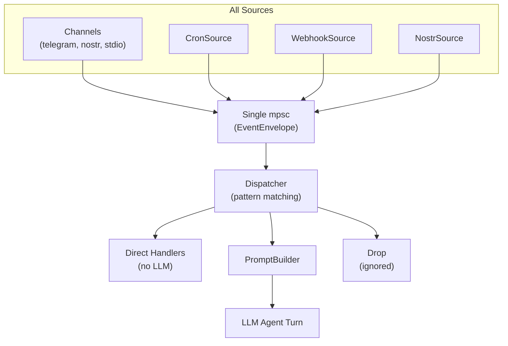

# Event Dispatch

## Overview

All inbound events — channel messages, cron ticks, webhooks, Nostr events, location updates, button presses — flow through a single dispatch pipeline. Each event gets a hierarchical dispatch key that maps to rules defining how it's processed.

## Components



## EventEnvelope

The unified event type. Everything produces this — channels, cron, webhooks, Nostr subscriptions.

```rust
pub struct EventEnvelope {
    // Dispatch
    pub dispatch_key: String,            // computed once at creation

    // Source
    pub source: EventSource,
    pub kind: String,                    // "message", "callback", "location_update", "cron", "webhook"

    // Channel context (present for channel-originated events)
    pub channel: Option<String>,         // "telegram", "nostr", "stdio"
    pub chat_id: Option<String>,
    pub thread_id: Option<String>,
    pub sender_id: Option<String>,
    pub sender_name: Option<String>,
    pub sender_handle: Option<String>,
    pub chat_type: Option<ChatType>,
    pub group_subject: Option<String>,

    // Content (one or more populated)
    pub text: Option<String>,            // message text (stripped of mentions)
    pub raw_text: Option<String>,        // original with mentions
    pub location: Option<Location>,
    pub callback_data: Option<String>,
    pub callback_query_id: Option<String>,
    pub attachments: Vec<Attachment>,
    pub metadata: Option<Value>,         // structured data (webhook payload, etc.)

    // Reply context
    pub reply_to_id: Option<String>,
    pub reply_to_text: Option<String>,
    pub reply_to_sender: Option<String>,

    // Mentions
    pub mentions: Vec<String>,
    pub was_mentioned: bool,

    // Timing
    pub timestamp: u64,
    pub message_id: Option<String>,      // platform message ID (for reactions, replies)
}

pub enum EventSource {
    Channel(String),     // "telegram", "nostr", "stdio"
    Cron(String),        // task id
    Webhook(String),     // source name
    Nostr(String),       // filter id
}
```

## Dispatch Key Format

Hierarchical, glob-matchable: `{source}:{kind}:{context...}`

| Event | dispatch_key |
|---|---|
| Text in group | `telegram:message:-1001234` |
| Text in topic | `telegram:message:-1001234:42` |
| DM to bot | `telegram:message:direct:60996061` |
| Button press | `telegram:callback:approve_deploy` |
| Live location update | `telegram:location_update:-1001234:60996061` |
| Voice message | `telegram:voice:-1001234` |
| Photo in DM | `telegram:media:direct:60996061` |
| Heartbeat cron | `cron:heartbeat` |
| Consolidation cron | `cron:consolidate` |
| GitHub push webhook | `webhook:github/push` |
| CI callback | `webhook:ci/complete` |
| Nostr DM | `nostr:dm` |
| Nostr group mention | `nostr:group:relay.example.com/groupid` |
| Stdio input | `stdio:message` |

### Key Construction

```rust
impl EventEnvelope {
    fn compute_dispatch_key(&self) -> String {
        match &self.source {
            EventSource::Channel(ch) => {
                let kind = &self.kind;
                match (&self.chat_type, &self.chat_id, &self.sender_id) {
                    (Some(ChatType::Direct), _, Some(sender)) =>
                        format!("{ch}:{kind}:direct:{sender}"),
                    (_, Some(chat), _) => match &self.thread_id {
                        Some(thread) => format!("{ch}:{kind}:{chat}:{thread}"),
                        None => format!("{ch}:{kind}:{chat}"),
                    },
                    _ => format!("{ch}:{kind}"),
                }
            }
            EventSource::Cron(id) => format!("cron:{id}"),
            EventSource::Webhook(name) => format!("webhook:{name}"),
            EventSource::Nostr(filter) => format!("nostr:{filter}"),
        }
    }
}
```

## Dispatch Rules

Stored in Nomen as `config/dispatch/*` topics. Matched in order, first match wins.

```rust
struct DispatchRule {
    pub pattern: String,              // glob pattern
    pub action: DispatchAction,
    pub prompt_config: Option<String>, // Nomen topic for prompt assembly
}

enum DispatchAction {
    /// Full LLM agent turn
    AgentTurn,
    /// Direct handler, no LLM
    Handler(String),
    /// Ignore the event
    Drop,
}
```

### Example Rules

```
config/dispatch/rules → [
    { pattern: "telegram:location_update:*",    action: "handler:live_location_tracker" },
    { pattern: "telegram:callback:ack_*",       action: "handler:auto_ack" },
    { pattern: "cron:heartbeat",                action: "agent_turn", prompt_config: "config/prompts/heartbeat" },
    { pattern: "cron:consolidate",              action: "handler:memory_consolidate" },
    { pattern: "webhook:github/*",              action: "agent_turn", prompt_config: "config/prompts/webhook" },
    { pattern: "telegram:message:*",            action: "agent_turn", prompt_config: "config/prompts/telegram" },
    { pattern: "nostr:dm",                      action: "agent_turn", prompt_config: "config/prompts/nostr" },
    { pattern: "stdio:*",                       action: "agent_turn", prompt_config: "config/prompts/default" },
]
```

Default (no rule match): `AgentTurn` with `config/prompts/default`.

## Handlers

Named handlers registered at startup. No LLM involved — pure code.

```rust
#[async_trait]
trait EventHandler: Send + Sync {
    fn name(&self) -> &str;
    async fn handle(&self, event: &EventEnvelope, ctx: &HandlerContext) -> Result<()>;
}

struct HandlerContext {
    pub channels: HashMap<String, Arc<dyn Channel>>,
    pub nomen: MemoryClient,
}
```

### Built-in Handlers

| Handler | Trigger | Action |
|---|---|---|
| `live_location_tracker` | `*:location_update:*` | Call `edit_location()` on the channel, store in Nomen |
| `auto_ack` | `*:callback:ack_*` | Answer callback query, no response |
| `memory_consolidate` | `cron:consolidate` | Call `memory.consolidate` on Nomen |
| `health_ping` | `cron:health_ping` | Check Nomen health, alert if down |

Custom handlers can be added in code or (future) as WASM plugins.

## Prompt Assembly

When dispatch action is `AgentTurn`, the prompt is built from Nomen memories:

```rust
struct PromptBuilder {
    nomen: MemoryClient,
}

impl PromptBuilder {
    async fn build(&self, event: &EventEnvelope, prompt_config: &str) -> Result<String> {
        // 1. Load prompt config (list of topic references)
        let config = self.nomen.get(prompt_config).await?;
        let parts: Vec<String> = parse_parts(config);

        // 2. Fetch all parts in batch
        let memories = self.nomen.get_batch(&parts).await?;

        // 3. Assemble in order
        let mut prompt = String::new();
        for memory in memories {
            prompt.push_str(&memory.detail.unwrap_or(memory.summary));
            prompt.push_str("\n\n");
        }

        // 4. Append group/chat-specific context if available
        if let Some(chat_id) = &event.chat_id {
            if let Ok(Some(ctx)) = self.nomen.get(&format!("prompt/chat/{chat_id}")).await {
                prompt.push_str(&ctx.detail.unwrap_or(ctx.summary));
                prompt.push_str("\n\n");
            }
        }

        // 5. Append pinned memories
        let pinned = self.nomen.list("pinned/").await?;
        for m in pinned {
            prompt.push_str(&format!("## {}\n{}\n\n", m.topic, m.summary));
        }

        Ok(prompt)
    }
}
```

### Prompt Config Examples

```
config/prompts/default   → { parts: ["prompt/identity", "prompt/capabilities", "prompt/rules"] }
config/prompts/telegram  → { parts: ["prompt/identity", "prompt/capabilities", "prompt/rules", "prompt/telegram"] }
config/prompts/heartbeat → { parts: ["prompt/identity", "prompt/heartbeat"] }
config/prompts/webhook   → { parts: ["prompt/identity", "prompt/capabilities", "prompt/webhook"] }
```

## Agent Loop (updated)

```rust
loop {
    let event = event_rx.recv().await?;

    // 1. Match dispatch rule
    let rule = dispatcher.match_rule(&event.dispatch_key);

    // 2. Route
    match rule.action {
        DispatchAction::Handler(name) => {
            handlers.get(&name)?.handle(&event, &ctx).await?;
        }
        DispatchAction::AgentTurn => {
            let prompt_config = rule.prompt_config
                .unwrap_or("config/prompts/default".into());
            let prompt = prompt_builder.build(&event, &prompt_config).await?;

            // Per-message context enrichment
            if let Some(text) = &event.text {
                let context = nomen.search(text, 5).await?;
                // inject context between prompt and message
            }

            let response = llm.prompt(&prompt, &message).await?;
            // ... handle response, tool calls, etc.
        }
        DispatchAction::Drop => {}
    }
}
```

## Crate Placement

- `nocelium-core/src/dispatch.rs` — `EventEnvelope`, `DispatchRule`, `Dispatcher`, dispatch key computation
- `nocelium-core/src/prompt.rs` — `PromptBuilder`, prompt assembly from Nomen parts
- `nocelium-core/src/handlers/` — built-in `EventHandler` implementations
- `nocelium-core/src/agent.rs` — updated agent loop with dispatch

## Config (Nomen)

| Topic | Contents |
|---|---|
| `config/dispatch/rules` | Ordered list of dispatch rules |
| `config/prompts/*` | Prompt part lists per context |
| `prompt/*` | Individual prompt parts (identity, rules, channel-specific, etc.) |
| `prompt/chat/*` | Per-chat/group context |
