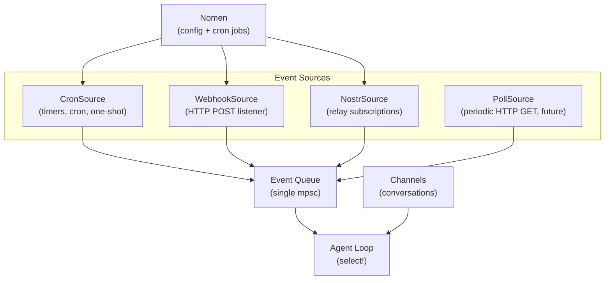

# Event Sources

## Overview

Event sources are the unified inbound reactive layer. All non-conversational triggers — timers, webhooks, Nostr subscriptions, polls — are event sources that push into a single queue consumed by the agent loop.

The scheduler is not a separate system. It's just `CronSource` — one implementation of the `EventSource` trait.

## Components



## EventSource Trait

```rust
#[async_trait]
trait EventSource: Send + Sync {
    /// Start listening, push events to the sender
    async fn start(&self, tx: mpsc::Sender<IncomingEvent>) -> Result<()>;
    fn name(&self) -> &str;
}

struct IncomingEvent {
    source: String,              // "cron", "webhook", "nostr", "poll"
    kind: String,                // "heartbeat", "github/push", "dm"
    payload: String,             // message to inject into agent loop
    metadata: Option<Value>,     // structured data (optional)
    received_at: DateTime<Utc>,
}
```

All sources share a single `mpsc::Sender<IncomingEvent>`. The agent loop holds the receiver and `select!`s between the Channel and the event queue.

## CronSource (replaces scheduler)

CronSource reads scheduled tasks from Nomen and fires them as events.

```rust
struct CronTask {
    id: String,
    schedule: Schedule,
    payload: String,            // message injected into agent loop
    enabled: bool,
    last_run: Option<DateTime<Utc>>,
}

enum Schedule {
    Cron(String),               // "0 */6 * * *"
    Interval(Duration),         // every 30 minutes
    At(DateTime<Utc>),          // one-shot
}
```

**Storage:** Cron tasks are Nomen memories under `cron/*` topics:
```
cron/heartbeat      → { schedule: "0 */6 * * *", payload: "Run heartbeat checks" }
cron/consolidate    → { schedule: "0 3 * * *", payload: "Consolidate memories" }
cron/reminder-xyz   → { schedule: "2025-04-01T09:00:00Z", payload: "Remind k0 about..." }
```

CronSource loads these at startup via `NomenClient`, tracks `next_run` in memory, and pushes `IncomingEvent` when tasks are due. One-shot tasks (`At`) are deleted from Nomen after firing.

**Self-managing:** The agent can create/modify/delete cron jobs via `nomen_store`/`nomen_delete` tools — no special scheduler tools needed.

## WebhookSource

- Lightweight HTTP server (axum)
- Accepts POST to `/webhook` or `/webhook/:source`
- Optional HMAC signature verification per source
- Config read from Nomen (`config/events/webhook`)
- Use cases: GitHub webhooks, CI callbacks, external services

## NostrSource

- Subscribes to Nostr relays with configurable filters
- Triggers on: DMs to agent npub, NIP-29 mentions, custom event kinds
- Config read from Nomen (`config/events/nostr`)
- Uses agent's `nostr-sdk` client

## PollSource (future)

- Periodic HTTP GET with change detection
- Config read from Nomen (`config/events/poll`)
- For sources without push support (RSS, APIs)

## Agent Loop Integration

```mermaid
sequenceDiagram
    participant Src as EventSource (any)
    participant Q as Event Queue (mpsc)
    participant Loop as Agent Loop
    participant LLM as LLM
    participant Tools as Tools

    Src->>Q: IncomingEvent
    Q->>Loop: recv() via select!
    Note over Loop: Format as: "[Event: {source}/{kind}] {payload}"
    Loop->>LLM: prompt(formatted event)
    LLM->>Tools: decide action (tools for outbound)
    Tools->>LLM: result
    LLM->>Loop: done
```

## Nomen Topics

| Topic | Contents |
|---|---|
| `config/events/webhook` | bind address, per-source secrets |
| `config/events/nostr` | relay filters |
| `cron/*` | individual cron tasks (schedule + payload) |

## Crate Placement

- `nocelium-core/src/events.rs` — `EventSource` trait, `IncomingEvent`, queue wiring
- `nocelium-core/src/sources/cron.rs` — CronSource (reads cron/* from Nomen)
- `nocelium-core/src/sources/webhook.rs` — WebhookSource
- `nocelium-core/src/sources/nostr.rs` — NostrSource
- Agent loop changes in `nocelium-core/src/agent.rs` — add `select!` on event receiver
