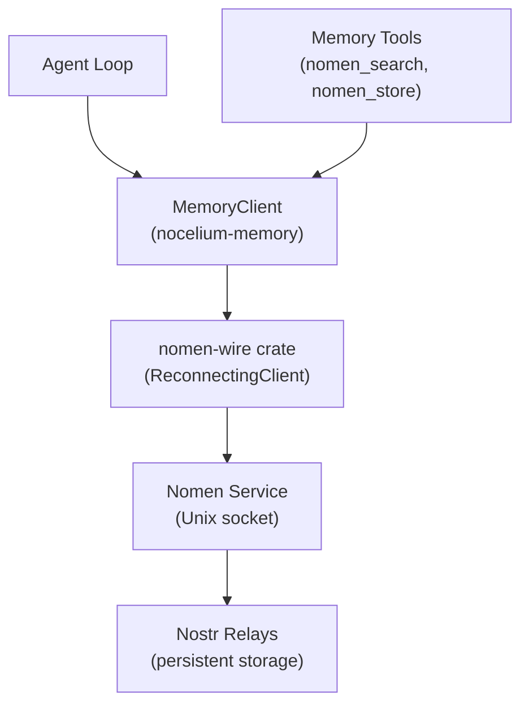
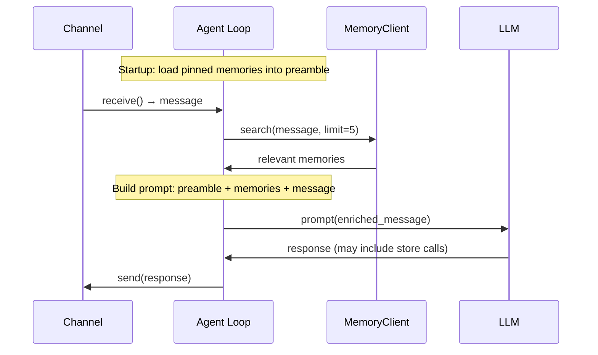

# Memory (Nomen Integration)

## Overview

Nomen is the collective memory layer — semantic search over knowledge stored on Nostr relays. The `nocelium-memory` crate provides the client interface.

## Components



## Transport

Nocelium uses the `nomen-wire` crate directly — Nomen's own client library for Unix socket communication. No custom transport layer.

```rust
use nomen_wire::ReconnectingClient;

let wire = ReconnectingClient::new("/run/nomen.sock", 3);
let resp = wire.request("memory.search", json!({"query": "...", "limit": 10})).await?;
```

`ReconnectingClient` handles connection drops and automatic reconnection with exponential backoff.

See [nomen-contract.md](nomen-contract.md) for wire protocol details and all dispatch actions.

## Client Interface

`nocelium-memory` wraps `nomen-wire::ReconnectingClient` with typed convenience methods.

Current surface is intentionally small and aligned with what Nocelium actually uses:

```rust
struct MemoryClient {
    wire: ReconnectingClient,
}

impl MemoryClient {
    // Memory reads/writes
    async fn search(&self, query: &str, limit: usize, visibility: Option<&Visibility>, scope: Option<&str>) -> Result<Vec<Memory>>;
    async fn get(&self, topic: &str) -> Result<Option<Memory>>;
    async fn list(&self, visibility: Option<&Visibility>, limit: usize) -> Result<Vec<Memory>>;
    async fn store(&self, topic: &str, detail: &str, visibility: Option<&Visibility>, scope: Option<&str>) -> Result<String>;
    async fn delete(&self, topic: &str) -> Result<()>;

    // Collected messages
    async fn message_store(&self, event: Value) -> Result<()>;
    async fn message_query(&self, params: &MessageQueryParams) -> Result<CollectedMessageQueryResult>;
    async fn message_context(&self, params: &MessageContextParams) -> Result<CollectedMessageQueryResult>;
}
```

## Data Model

```rust
struct Memory {
    pub topic: String,
    pub detail: String,
    pub confidence: Option<f64>,
    pub visibility: Option<String>,
    pub scope: Option<String>,      // context qualifier (group ID, room, etc.)
}

/// Maps to Nomen's visibility levels.
enum Visibility {
    Public,      // visible to all, synced to relays
    Group,       // shared within a group (scope = group ID)
    Circle,      // shared within a circle (scope = circle ID)
    Personal,    // agent-private
    Internal,    // agent-private, never synced to relays
}
```

### Collected Message Model

For conversation history, canonical container identity comes from normalized collected-message fields:

- `platform`
- optional `community`
- `chat_id`
- optional `thread_id`

Use `message.store` for writes and `message.query` / `message.context` for reads. Do not teach `message.list` or a single legacy `channel` field as the canonical message container identity.

### Visibility + Scope

Nomen uses `visibility` (who can see it) and `scope` (within what context) together:

| Visibility | Scope | Use case |
|---|---|---|
| `internal` | — | Agent config, cron jobs (local only) |
| `personal` | — | Agent-private knowledge |
| `group` | group ID | Shared with other agents in same group |
| `circle` | circle ID | Shared with a defined circle |
| `public` | — | Published to relays, anyone can read |

### Defaults for Nocelium Topics

| Topic prefix | Default visibility | Rationale |
|---|---|---|
| `config/*` | `internal` | Agent config, never leaves the machine |
| `cron/*` | `internal` | Local scheduling (use `group` for multi-agent) |
| Knowledge | `group` or `public` | Collective memory — meant to be shared |

The `MemoryClient` applies these defaults but allows override per call.

## Integration Points

### 1. Prompt Injection (startup)
At agent build time, fetch pinned memories and append to preamble:
```
preamble + "\n\n## Pinned Memories\n" + pinned_memories
```

### 2. Context Enrichment (per-message)
Before each LLM call, search relevant memories and inject as context:
```
user_message + "\n\n## Relevant Context\n" + search_results
```

### 3. Knowledge Storage (post-response)
After generating a response, the agent can store new knowledge via tools.

### 4. Consolidation (scheduled)
CronSource task runs `memory.consolidate` to merge/prune memories.

### 5. Push Events
Subscribe to `memory.updated` / `memory.deleted` to react to config changes by other agents in real-time.

## Agent Loop with Memory



## Key Nomen Dispatch Actions

| Action | Purpose |
|---|---|
| `memory.search` | Semantic search (vector + keyword + graph) |
| `memory.put` | Store a memory |
| `memory.get` | Retrieve by topic |
| `memory.list` | List memories |
| `memory.delete` | Remove a memory |
| `message.store` | Store collected-message kind 30100 events |
| `message.query` | Query collected messages with canonical filters |
| `message.context` | Retrieve surrounding collected-message context |
| `memory.pin` / `memory.unpin` | Control preamble injection |
| `memory.consolidate` | Merge and prune |

Full action reference: [nomen-contract.md](nomen-contract.md)

## Config

Nomen connection is in the bootstrap TOML (see [config.md](config.md)):
```toml
[nomen]
socket_path = "/run/nomen.sock"
```

Memory behavior settings stored in Nomen itself:
```
config/agent → { pinned_topics: ["identity", "rules"], search_limit: 5 }
```

## Crate Placement

- `nocelium-memory/Cargo.toml` — depends on `nomen-wire` (path or git)
- `nocelium-memory/src/lib.rs` — `MemoryClient`, `Memory` types, wraps `ReconnectingClient`
- `nocelium-tools/src/nomen.rs` — `nomen_search`, `nomen_store` tools
