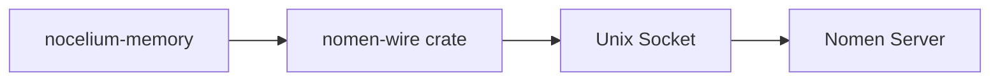

# Nomen Contract

Nocelium's hard dependency on Nomen. This doc tracks what we use and when it was last verified.

## Last Verified

- **Nomen commit:** `cf89b2a` (2025-03-22)
- **nomen-wire version:** 0.1.0
- **Protocol:** Length-prefixed JSON frames over Unix socket

## Connection

Nocelium uses `nomen-wire` crate directly as a dependency (path or git). No custom client needed.

```rust
use nomen_wire::ReconnectingClient;

let client = ReconnectingClient::new("/run/nomen.sock", 3);
let resp = client.request("memory.search", json!({"query": "...", "limit": 10})).await?;
```

`ReconnectingClient` handles connection drops and automatic reconnection with exponential backoff.

## Wire Protocol

**Frame types** (untagged JSON, length-prefixed):

| Frame | Discriminator | Direction |
|---|---|---|
| `Request` | has `action` field | agent → nomen |
| `Response` | has `ok` + `id` fields | nomen → agent |
| `Event` | has `event` field | nomen → agent (push) |

**Request:**
```json
{"id": "req-1", "action": "memory.search", "params": {"query": "...", "limit": 10}}
```

**Response:**
```json
{"id": "req-1", "ok": true, "result": {...}, "meta": {"version": "v2"}}
```

**Event (push):**
```json
{"event": "memory.updated", "ts": 1711100000, "data": {...}}
```

## Dispatch Actions Used by Nocelium

### Core (required)

| Action | Purpose | Key Params |
|---|---|---|
| `memory.search` | Semantic search for context enrichment | `query`, `limit`, `visibility`, `scope`, `vector_weight`, `text_weight` |
| `memory.put` | Store config, cron tasks, knowledge | `topic`, `summary`, `detail`, `visibility`, `scope` |
| `memory.get` | Retrieve config topic | `topic` |
| `memory.get_batch` | Retrieve multiple config topics at startup | `topics[]` |
| `memory.list` | List cron/* or config/* topics | `prefix`, `limit` |
| `memory.delete` | Remove one-shot cron tasks, config cleanup | `topic` |
| `memory.pin` | Mark memories for preamble injection | `topic` |
| `memory.unpin` | Remove from preamble injection | `topic` |

### Optional (future)

| Action | Purpose |
|---|---|
| `memory.consolidate` | Periodic memory maintenance |
| `memory.embed` | Force re-embedding |
| `memory.sync` | Relay sync |
| `message.ingest` | Conversation history storage |
| `message.context` | Retrieve conversation context |
| `entity.list` | Knowledge graph queries |
| `entity.relationships` | Entity relationship lookup |

### Push Events (subscribe)

| Event | Purpose |
|---|---|
| `memory.updated` | React to config changes by other agents |
| `memory.deleted` | React to cron task removal |

## Visibility & Scope

Nomen controls access via `visibility` (who can see) and `scope` (within what context):

| Visibility | Scope | Relay sync | Description |
|---|---|---|---|
| `public` | — | ✅ | Anyone can read |
| `group` | group ID | ✅ | Shared within a Nostr group |
| `circle` | circle ID | ✅ | Shared within a defined circle |
| `personal` | — | ✅ | Author-private, synced to relays |
| `internal` | — | ❌ | Local only, never leaves the machine |

Resolution order in Nomen: explicit `visibility`+`scope` params → legacy `tier` param → default channel fallback.

### Nocelium Defaults

| Topic prefix | Visibility | Rationale |
|---|---|---|
| `config/*` | `internal` | Agent config stays local |
| `cron/*` | `internal` | Local scheduling |
| Knowledge | `group` / `public` | Collective memory |

## Nomen Config Topics

These well-known topics are used by Nocelium for self-configuration:

```
config/agent           → preamble, max_tokens, streaming
config/provider        → model, base_url, api_key
config/channels/*      → telegram, nostr settings
config/tools           → tool toggles
config/events/webhook  → webhook listener settings
config/events/nostr    → nostr event filter settings
cron/*                 → scheduled tasks
```

## Integration Pattern



`nocelium-memory` wraps `nomen-wire::ReconnectingClient` with Nocelium-specific types and convenience methods. All Nomen protocol details stay in `nomen-wire`.

## Updating

When Nomen's API changes:
1. Update `nomen-wire` dependency
2. Run `just test-nomen` (integration tests against live socket)
3. Update dispatch actions table above
4. Update this "Last Verified" section

## nomen-wire Dependency

```toml
# In nocelium-memory/Cargo.toml
# Option A: git dependency (tracks main)
nomen-wire = { git = "https://github.com/user/nomen", path = "nomen-wire" }

# Option B: local path (during co-development)
nomen-wire = { path = "../../nomen/nomen-wire" }
```

During active co-development, use path dependency. Switch to git when Nomen stabilizes.
