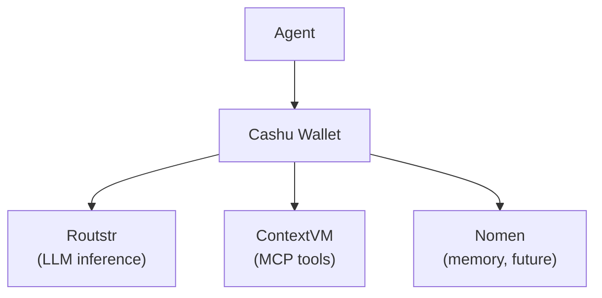

# Payments

## Overview

Payments are a first-class primitive — agents carry wallets, not API keys. Every resource has a cost paid in Bitcoin via Cashu eCash.

## Payment Points



| Resource | Protocol | Payment Method |
|---|---|---|
| LLM inference | OpenAI-compat API | Cashu token as API key (Routstr) |
| MCP tools | ContextVM CEP-8 | Lightning invoice or Cashu |
| Memory storage | Nomen (future) | Cashu per-write |

## Routstr Provider

Routstr is an OpenAI-compatible API that accepts Cashu eCash tokens for payment:

- Uses rig's OpenAI provider with custom `base_url`
- Auth: Cashu token in API key field
- Pay-per-request, no subscription
- Provider discovery via Nostr relays

```rust
let client = openai::CompletionsClient::builder()
    .api_key(&cashu_token)
    .base_url(&routstr_url)
    .build()?;
```

## ContextVM CEP-8

MCP tools accessed over Nostr via ContextVM can require payment:

1. Agent requests tool invocation
2. Server responds with payment required (CEP-8)
3. Agent pays Lightning invoice or sends Cashu
4. Server executes tool, returns result

## Wallet Integration

```rust
struct CashuWallet {
    mint_url: String,
    tokens: Vec<Token>,
}

impl CashuWallet {
    async fn balance(&self) -> u64;
    async fn pay(&self, amount: u64) -> Result<Token>;
    async fn receive(&mut self, token: Token) -> Result<()>;
}
```

The scheduler checks wallet balance before executing paid tasks (see [scheduler.md](scheduler.md)).

## Config

```toml
[payments]
enabled = false
mint_url = "https://mint.example.com"
wallet_path = "~/.nocelium/wallet.db"

[provider]
type = "routstr"
model = "openai/gpt-4o"
base_url = "https://routstr.com/v1"
# api_key comes from wallet token, not static config
```

## Status

**Not yet implemented.** Currently using static API keys via OpenRouter. Payment integration is milestone M4.
