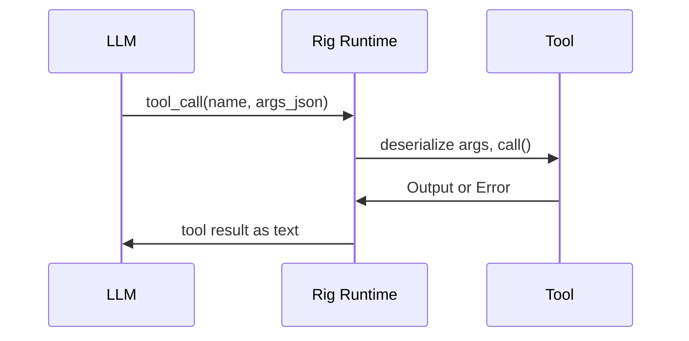

# Tools

## Overview

Tools give the agent capabilities beyond text generation. Each tool implements rig's `Tool` trait and is registered in the agent builder.

## Tool Trait (rig)

```rust
trait Tool {
    const NAME: &'static str;
    type Error: std::error::Error;
    type Args: DeserializeOwned + JsonSchema;
    type Output: Display + Serialize;

    async fn definition(&self, prompt: String) -> ToolDefinition;
    async fn call(&self, args: Self::Args) -> Result<Self::Output, Self::Error>;
}
```

The LLM sees `ToolDefinition` (name + description + JSON Schema for args) and can invoke tools by name. Rig handles the call dispatch.

## Implemented Tools

| Tool | File | Description |
|---|---|---|
| `shell` | `shell.rs` | Execute shell commands (sh -c), timeout support |
| `read_file` | `filesystem.rs` | Read file contents |
| `write_file` | `filesystem.rs` | Write/create files, auto-creates parent dirs |

## Planned Tools

| Tool | File | Description |
|---|---|---|
| `nomen_search` | `nomen.rs` | Search collective memory |
| `nomen_store` | `nomen.rs` | Store to collective memory |
| `schedule_add` | `schedule.rs` | Create scheduled task |
| `schedule_list` | `schedule.rs` | List scheduled tasks |
| `schedule_remove` | `schedule.rs` | Remove scheduled task |
| `http_request` | `http.rs` | General HTTP client |
| `web_search` | `web_search.rs` | Web search (Brave/SearXNG) |
| `contextvm` | `contextvm.rs` | MCP tools over Nostr |

## Registration

Tools are registered in `nocelium-core/src/agent.rs` via the rig agent builder:

```rust
let agent = client
    .agent(&config.provider.model)
    .preamble(&preamble)
    .tool(ShellTool)
    .tool(ReadFileTool)
    .tool(WriteFileTool)
    // future: .tool(NomenSearchTool::new(nomen_client))
    .build();
```

Tools that need runtime state (NomenClient, scheduler handle) take dependencies via constructor.

## Tool Interaction Flow



## Adding a New Tool

1. Create `crates/nocelium-tools/src/tool_name.rs`
2. Define `Input` struct with `#[derive(Deserialize, JsonSchema)]`
3. Define `Output` type implementing `Display + Serialize`
4. Define error type with `#[derive(thiserror::Error)]`
5. Implement `Tool` trait
6. Add `pub mod tool_name;` + `pub use` to `lib.rs`
7. Register `.tool(ToolName)` in `agent.rs`
8. Update this doc

## Crate Placement

All tools in `nocelium-tools/src/`, one file per tool (or per logical group like filesystem).
